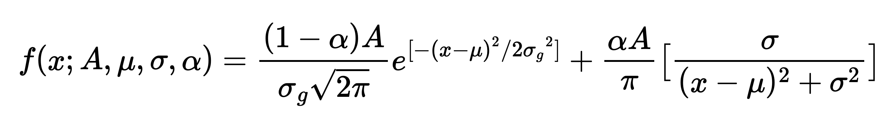

############################
Simple sequential refinement
############################

The purpose of this tutorial is to familiarize you with the basic functions of the Viewer.

******
Import
******

P61A beamline saves spectra as NeXuS ``.nxs`` files and metadata as FIO ``.fio`` files.
The beamline conrtrol software `SPOCK <https://hasyweb.desy.de/services/computing/Spock/Spock.pdf>`_ is set up in
such a way, that if you make a single acquisition using ``ct`` command,
just one ``.nxs`` file will be saved, and if you make a scan (``ascan``, ``dscan``, ``mesh``, etc.), a ``.fio`` file
with motor positions will be created, and next to it a directory by the same name with the ``.nxs`` files collected at
different motor positions.

In P61A::Viewer you can import just NeXuS files (without motor positions and other metadata) and FIO files
(with all corresponding spectra and metadata) using the ``+`` button.

For this tutorial we have prepared a simple dataset you can download
`here <https://github.com/hereon-GEMS/P61AToolkit/blob/master/data/tutorials/simple_sequential_refinement.zip>`_.
As a first step, import the dataset by pressing the ``+`` button on the Viewer and selecting the FIO file.

*************
Project files
*************

After you have imported the data, you should save your analysis using File -> Save As menu.
The format of the project files is ``.pickle``, and they are just
`serialized <https://docs.python.org/3/library/pickle.html>`_ Python 3 objects.

Project files are cross-platform and self-sufficient: you do not need to store them next to the collected data and can
transfer them from one computer to another.

.. warning::
    P61A Toolkit is a young project with high expectancy of bugs! Software may freeze or crash.
    To avoid frustration, please save your analysis regularly.

***********
View / Sort
***********

The dataset for this tutorial is called ``sdp_00001``, which stands for Shifting Double Peaks.
Purpose of this tutorial is to show you how P61A::Viewer treats peaks during sequential refinement.

First step of sequential refinement is organizing your data. You can sort the datasets by
name, detector dead time, fit quality, and metadata values by clicking on the column headers of the dataset table.
You can also add / remove columns from the table by right-clicking the header, and selecting metadata variables in the
popup menu.

In this dataset values for ``eu.x``, ``eu.y`` and ``eu.z`` are random. You can sort the data by them to see how it
looks, but to continue we need to have data sorted by Name or ``xspress3_index``.

.. _peak-search:

***********
Peak search
***********

The peak search algorithm in P61A::Viewer searches for local maxima in the datasets, and then filters them by the
following criteria:

1. **Height:** Minimal height of the point to be considered a peak.

2. **Distance:** Minimal distance between two peaks in keV.

3. **Width:** Minimal width (FWHM) of the peak in keV.

4. **Prominence:** Minimal distance between the peak and the surrounding baseline.

If you want to learn more about the algorithm, you can find its description
`here <https://docs.scipy.org/doc/scipy/reference/generated/scipy.signal.find_peaks.html>`__.

For the tutorial dataset the appropriate parameters are: ``Height 1000.``, ``Distance 2.``, ``Width 0.3``,
``Prominence 800.``. After you have set the values, press ``Find`` button and perform the search over all spectra.

To get a sense of what these parameters mean, we recommend you play around with the values: change them one by one,
repeat the search, and see at what value of each parameter peaks start disappearing.

.. _peak-tracking:

*************
Peak tracking
*************

After the peak search has found all appropriate peaks in all specified spectra, you can organize peaks into tracks.
Tracks should follow the same physical peak over all analysed spectra. Since different datasets may have different variance in
peak positions between spectra, you have to define the **Track window**: maximal distance between the peak positions in
the neighbouring spectra. The algorithm connects two closest peaks in the neighbouring spectra if the distance between
them is less than the **Track window** value.

For the tutorial dataset to be tracked properly, the **Track window** should be set to 1.
When you press ``Make tracks`` button, tracks should appear on the plot.
To understand what exactly **Track window** does, try playing around with it, increase or decrease it.

.. _peak-refinement:

***************
Peak refinement
***************

To refine the automatically generated peak positions, go to the ``Peak fit`` tab.

Every peak has a set of refineable parameters, and a set of non-refineable parameters.
At the moment only pseudo-Voigt peak shape approximation is available in the Viewer, with the refineable parameters: **center**, **amplitude**, **sigma**, **fraction**.
Non-refineable parameters are: **width**, **height**, **base**, **overlap base**, **Rwp**, **chi2**.

The peak function follows the definition:

**Width** is calculated as FWHM, **height** is the max value of the peak function.

**Base** defines the peak function domain and is measured in sigmas. Every peak function is calculated according to the pseudo-Voigt expression within its domain ``[center - base * sigma, center + base * sigma]`` and is set as ``0`` outside the domain.
The way refinement works in P61A::Viewer is that every peak is only evaluated and refined over its **base**.
Usually **base** values between 3 and 7 give good results, depending on the peak's "skirt" and surrounding
background.
The choice of **base** value depends on each dataset and each peak.

Parameter **overlap_base** is also measured in sigmas and determines if peaks next to each other should be refined
together or separately: if for two peaks their overlap bases do in fact overlap, they will be refined together on an
interval made from combining their **bases**. By default **overlap_base** is set relatively small, so that every peak is
refined on its own. However, if you notice a drop in fit quality due to a couple of peaks being interdependent,
increasing their **overlap_base** until they are refined together may solve the issue.

In addition to the refineable parameters, **base**, and **overlap_base** there are also convenience parameters like
**height** and **width**, and per-peak fit quality metrics **rwp2** and **chi2**.

The dataset for this tutorial is relatively uncomplicated, so the automated peak search has done a good job initiating
the peak parameters. The only thing left to do is to launch the refinement:

* ``Fit peaks`` will refine peak parameters in the current spectra,
* ``Fit Background`` will do nothing in this dataset, since we have not added any background models
* ``Fit this`` will run peak and background fits in sequence until convergence is reached
* ``Fit multiple`` will let you run any of the options above on multiple spectra with additional options like
  initiating all fit models from current one.

For this dataset if you just run ``Fit multiple`` in its default mode on all spectra you should get reasonable fit
quality.

***********
Peak export
***********

After you are happy with the quality of the refinement, you can export the results using ``Export peaks`` button.
It is not important for the purposes of this tutorial, but will be important further on.