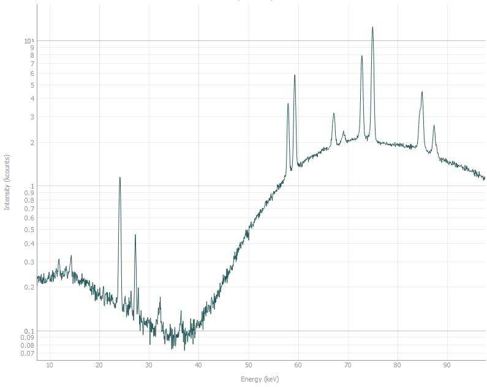
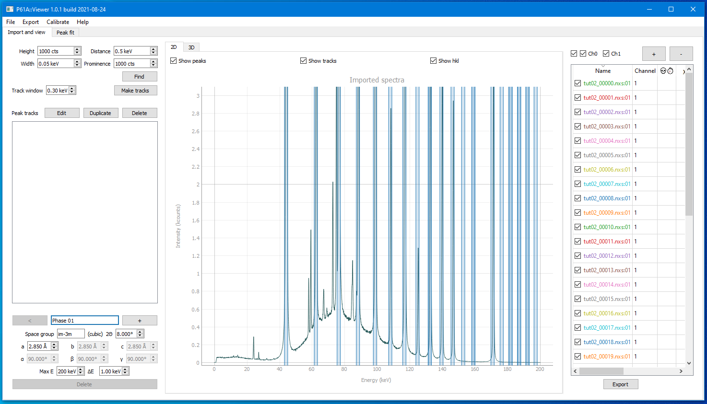
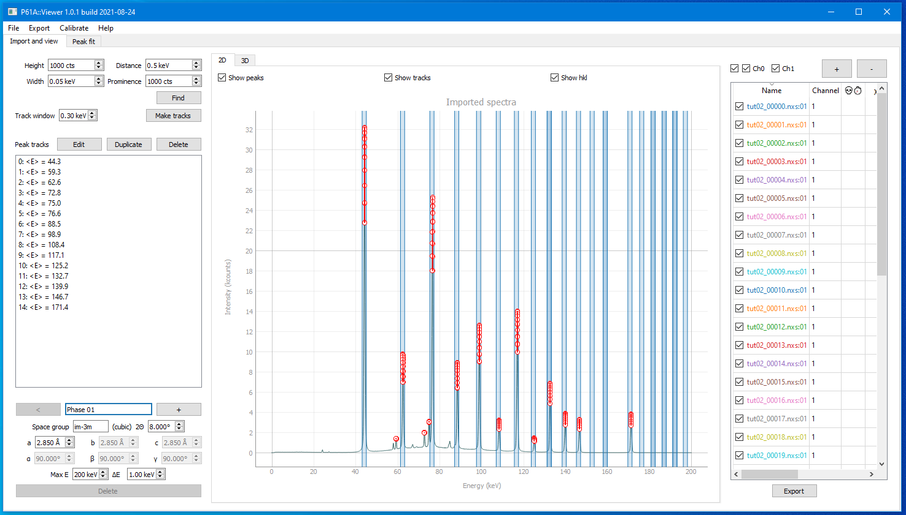

##########################
Realistic diffraction data analysis
##########################

The purpose of this tutorial is to introduce you to the way peak identification and fitting can be done on experimental
data using P61A::Viewer.

******
Import
******

This tutorial starts with the project file that you can find
`here <https://github.com/P61A-software/P61AToolkit/blob/master/data/tutorials/laplace_space_stress.pickle>`_.
This is a simulated BCC Fe diffraction pattern from a measurement in reflection.
Download the file and open it in Viewer using ``File -> Open`` menu.

*****************
Identifying peaks
*****************

First step of the analysis is understanding what you are looking at. In this dataset we expect to see diffraction from
one phase, and in any dataset coming from P61A we expect to see background that includes a few fluorescence peaks.
Here is what the background looks like without the sample in the beam:

The plot is in log scale for more clarity.
Most prominent fluorescence peaks are (in keV): ``24.2``, ``27.3``, ``58.0``, ``59.3``, ``67.2``, ``69.1``, ``72.8``,
``75.0``, ``84.9``, ``87.3``. They correspond with emission spectra of ``W`` and ``Pb``.

Compare this to the spectra with diffraction data.

.. image:: tut-02-img1.png
   :width: 600

Let us identify which peaks belong to Fe. We know that the measurements were performed at 2Θ = 8°,
and generally the cell parameter of BCC Fe is around 2.85 Å.
So we can set the parameters in the phase constructor in the bottom left as:
``Space group: im-3m``, ``a = 2.85 Å``, ``2Θ = 8°``, and check the ``Show hkl`` checkbox above the plot.
Stripes should appear indicating the modelled peak positions.

*************
Finding peaks
*************

Now that we know which peaks we want to fit, we can start setting up the refinement model.
Our goal here is to identify all the peaks that we have to fit to get good fit quality on the peaks that we want.

As a first attempt to do the peak search we can always launch it with default parameters.
So if you just press ``Find`` button in the top left corner you will get this

.. image:: tut-02-img3.png
   :width: 600

This is a pretty good starting point.
Multiple diffraction peaks are identified plus a few of their neighbours that we need to pay attention to.
That means you can press the ``Make Tracks`` button and proceed to the next step.

************
Tracks
************

Once you have pressed ``Make Tracks``, created tracks should appear on the list on the left

The idea behind the tracks is that each track follows the evolution of a peak over the collected spectra.

