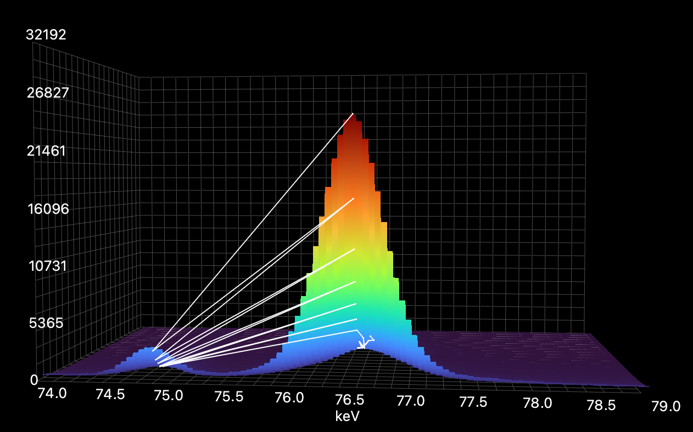
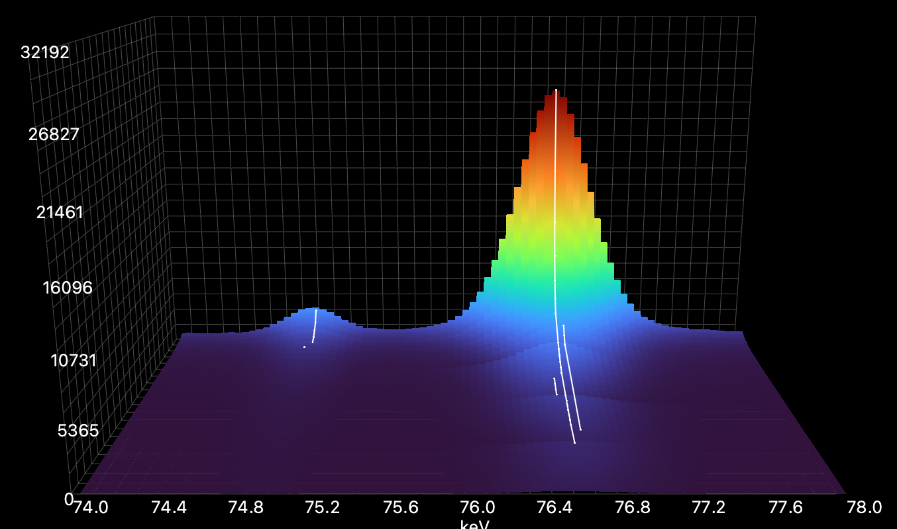
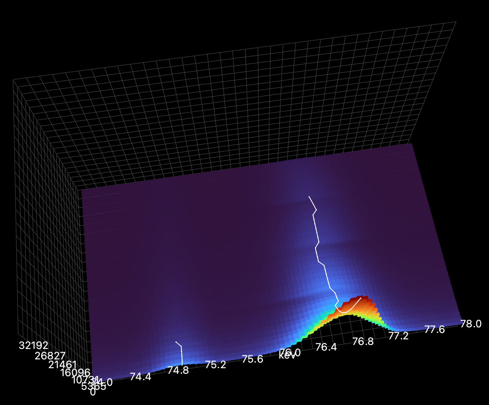

###################################
Realistic data refinement
###################################

The purpose of this tutorial is to introduce you to the way peak identification and fitting can be done on experimental
data using P61A::Viewer.

******
Import
******

This tutorial starts with the project file that you can find
`here <https://github.com/hereon-GEMS/P61AToolkit/blob/master/data/tutorials/laplace_space_stress.pickle>`_.
This is a simulated BCC Fe diffraction pattern from a measurement in reflection.
Download the file and open it in Viewer using ``File -> Open`` menu.

*****************
Identifying peaks
*****************

First step of the analysis is understanding what you are looking at. In this dataset we expect to see diffraction from
one phase, and in any dataset coming from P61A we expect to see background that includes a few fluorescence peaks.
Here is what the background looks like without the sample in the beam:

.. image:: tut-02-img0.png
   :width: 600

The plot is in log scale for more clarity.
Most prominent fluorescence peaks are (in keV): ``24.2``, ``27.3``, ``58.0``, ``59.3``, ``67.2``, ``69.1``, ``72.8``,
``75.0``, ``84.9``, ``87.3``. They correspond with emission spectra of ``W`` and ``Pb``.

Compare this to the spectra with diffraction data.

.. image:: tut-02-img1.png
   :width: 600

Let us identify which peaks belong to Fe. We know that the measurements were performed at 2Θ = 8°,
and generally the cell parameter of BCC Fe is around 2.85 Å.
So we can set the parameters in the phase constructor in the bottom left as:
``Space group: im-3m``, ``a = 2.85 Å``, ``2Θ = 8°``, and check the ``Show hkl`` checkbox above the plot.
Stripes should appear indicating the modelled peak positions.

.. image:: tut-02-img2.png
   :width: 600

*************
Finding peaks
*************

Now that we know which peaks we want to fit, we can start setting up the refinement model.

On one hand, you may want to fit as many peaks as you can identify on the image.
You have already collected the data, no reason to waste it.
On the other hand, the more peaks you have in the refinement model, the longer it takes to fit them.
Additionally, small peaks with high variance in position, amplitude, and especially width, take longer to refine and are prone to errors.
Minimizing algorithm tends to lose its way and often requires tedious adjustments when signal to noise ratio is low.

Unfortunately, all data is different, so there is very little general advice on how many peaks is the right amount for analysis.
The idea is that you choose as many prominent peaks as the Viewer can handle in reasonable time, while also adding all the small neighbouring peaks that can affect the fit quality.
This will become more clear in further sections.

As a first attempt to do the peak search we can always launch it with default parameters.
So if you just press ``Find`` button in the top left corner you will get this

.. image:: tut-02-img3.png
   :width: 600

This is a pretty good starting point.
Multiple diffraction peaks are identified plus a few of their neighbours that we need to pay attention to.
That means you can press the ``Make Tracks`` button and proceed to the next step.

***********************
Making tracks
***********************

Once you have pressed ``Make Tracks``, created tracks should appear on the list on the left

.. image:: tut-02-img5.png
   :width: 600

The list gives you the track positions and which hkl and phase they are identified as.

The track creation / editing workflow should go as follows:

#. Search for peaks.
#. If too many / not enough peaks were found, adjust peak search parameters (see :ref:`peak-search`) and search again.
#. Make tracks.
#. If the tracks do not follow the observed diffraction peaks, adjust ``Track Window`` parameter and then search and make tracks again (see :ref:`peak-tracking`).

``Track Window`` should be larger than the variance in peak position between the spectra and smaller than the distance between the two neighbouring peaks.
Checking if the track assignment was done correctly or not is convenient through the ``3D`` plot tab on ``Import and View``.

Here the ``Track Window`` is too large and different observed peaks are put into one track:

Here it is too small with multiple tracks created for one peak due to peak center variance:

Here it is chosen appropriately:

5. Once most / some of the peaks are tracked correctly, you can expand, move or create more tracks.

**************
Editing tracks
**************

If you double-click a track on the list or select multiple tracks and press ``Edit``, and editing menu will appear:

.. image:: tut-02-img9.png
   :width: 600

It shows and allows you to change data on the whole track at once.

The list of spectra on the right shows the spectra over which the track spans.
You can either remove the data by unchecking the spectra, or increase the span by checking more spectra.

Let us try an example. If you open the ``3D`` view, you will see that the tracks made with default parameters do not span over all spectra.
Now double-click track 0 (should be at ``44.3 keV``), in the spectra list of the pop-up window select all spectra (by pressing ``CTRL + a``, or with the mouse), and click the check box above the list so that all spectra are checked and press ``Ok``.
You will see that now track 0 spans over all spectra.

For the purposes of this tutorial, do the same thing to all tracks by selecting all of them at once and repeating the operation, but in principle this is not necessary.
If at a certain point some tracks just disappear into background, tracking or not tracking them over all spectra is up to you.

Now let us proceed with adding more tracks. Since tracks have a lot of information inside, is is unfeasible to create them from scratch.
What you can do instead, is choose a track that is similar to the one you want to make, duplicate it and then move it to another position.

If you look closely, you will see two small peaks at ``58 keV`` and ``59.4 keV``.
If you did the peak search with default parameters, only ``59.4 keV`` will have a track assigned to it.
To create a track at ``58 keV``, select the existing one on the list (``Track 1``, ``59.4 keV``), press ``Duplicate``, and in the popup set the center value to ``58`` and press ``Ok``.
You will see that another track has appeared.

You can delete tracks by selecting them on the list and pressing ``Delete``.

You can also edit the refinement parameters for the whole track using the same menu.
If you double-click a track, you can set the center and its refinement limits.
Note that if you set tight refinement limits for any parameter (center, sigma, etc.), its values will be "compressed" to always stay within the limits.

****************
Background
****************

Description of the peak models and basics of peak refinement can be found in the previous tutorial (see :ref:`peak-refinement`).
However, to successfully fit real data one also has to take into account the background.

In the Viewer background refinement is split from peak refinement, both can be performed independently from each other.
At the moment two types of background functions are implemented: ``Chebyshev`` polynomials and ``Interpolation``.
Both background functions have ``xmin`` and ``xmax`` parameters, defining the background domain.
In principle you can define as many different background functions as you want, as long as their domains do not overlap, which will produce mistakes.
Data used for background refinement is taken from the background domain ``[xmin, xmax]`` with exclusion of all the peak domains (``[center - base * sigma, center + base * sigma]`` for every peak).

Given the complicated shape of the background produced at P61A beamline, we have found that the ``Chebyshev`` model is only useful on relatively small domains and is prone to errors.
To refine the background as a whole with minimal input and good accuracy one has to use ``Interpolation``.

Please note, that on the ``Peak fit`` tab if you press ``+ background`` button, you only add a background function to the currently selected spectrum.
Once you have added, modified, and fitted all the background functions you want, you can press ``Copy background`` to copy it to the rest of the spectra.

After that you can proceed with the sequential refinement as described in :ref:`peak-refinement`.
